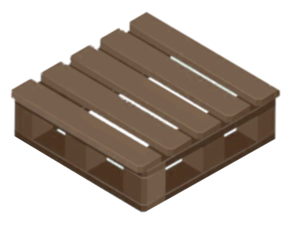

# uni.Paths

+ Upgrades `java.nio.file.Paths` to recognize MSYS2/cygwin mount points.
+ adds MSYS2/Cygwin filesystem view to jvm languages with only a modified import
+ existing code `java.nio.file.Paths.get()` (returns a `java.nio.file.Path` object)
+ no 3rd party libraries, 100% scala.
+ only configuration requirement is that a Windows posix shell `mount.exe` is in the PATH

Run Linux and Mac jvm code with on Windows without drive letters or backslashes.



Recognizes `posix` file paths in Windows, via customizable mount points in `C:/msys64/etc/fstab`.

* Supported Scala Versions
  * `scala 3.x`

* Tested Target environments
  * `Linux`
  * `Darwin/OSX`
  * `Windows`
    * `Cygwin64`
    * `Msys64`
    * `Mingw64`
    * `Git-bash`

### Usage

To use `uni` in an `SBT` project, add this dependency to `build.sbt`

```sbt
  "org.vastblue" % "uni_3" % "0.4.4"
  ```
For `scala 3.5+` or `scala-cli` scripts:
```sbt
  "//> using dep org.vastblue:uni_3:0.4.4"
```
## Simplicity and Portability
  * Script as though you're running in a Linux environment.
## Linux / MacOS Requirements
  * replace `import java.nio.file.Paths` with `import uni.Path`
  * or directly call `uni.Paths.get(...)`
  * no other changes needed (100% compatible drop in replacement for Paths.get)
## Windows Requirements
  ### a posix shell:
  * [MSYS64](https://msys2.org)
  * [CYGWIN64](https://www.cygwin.com)
  * [Git Bash](https://www.atlassian.com/git/tutorials/git-bash)
  ### `mount.exe` must be in the PATH

### Concept
  * `Paths.get` returns `java.nio.file.Path` objects
  * `Paths.get("/etc/fstab").toString` == `/etc/fstab` in most environments
  * `Paths.get("/etc/fstab").toString` == `C:\msys64\etc\fstab` (in MSYS64, for example)
  * `Paths.get("/etc/fstab").posx`     == `C:/msys64/etc/fstab`
  * `Paths.get("/etc/fstab").stdpath   == `/etc/fstab`

Examples below illustrate some of the capabilities.

### Background
Windows shell environments are provided by `cygwin64`, `msys64`, `Git-bash`, etc.
However, the `Windows` jvm doesn't recognize the filesystem abstractions of these environments.

This library provides the missing piece.

  * In Windows, a custom `Paths.get()` translates posix paths to Windows equivalent before calling `java.nio.file.Path.get()`
  * In other environments it passes path strings directly to `java.nio.file.Paths.get()`
  * convenience extension methods on `java.nio.file.Path` and `java.io.File` simplify writing portable code

### Example script: display the native path and the number of lines in `/etc/fstab`
The following example might surprise Windows developers, since JVM languages don't normally support posix file paths that aren't also legal Windows paths.

```scala
#!/usr/bin/env -S scala-cli shebang

//> using dep "org.vastblue::uni:0.4.4"

import uni.*
import uni.file.*

// display the native path and lines.size of /etc/fstab
// mapped to "C:\msys64\etc\fstab" in Windows
val p = Paths.get("/etc/fstab")
printf("%s\n", p.posx)
printf("env: %-10s| %-22s | %d lines\n", uname("-o"), p.posx, p.lines.size)
```
### Output of the previous example script on various platforms:
```
Linux Mint # env: GNU/Linux | shellRoot: /           | /etc/fstab            | 21 lines
Darwin     # env: Darwin    | shellRoot: /           | /etc/fstab            | 0 lines
WSL Ubuntu # env: GNU/Linux | shellRoot: /           | /etc/fstab            | 6 lines
Cygwin64   # env: Cygwin    | shellRoot: C:/cygwin64 | C:/cygwin64/etc/fstab | 24 lines
Msys64     # env: Msys      | shellRoot: C:/msys64/  | C:/msys64/etc/fstab   | 22 lines
```
Note that on Darwin, there is no `/etc/fstab` file, so the `Path#lines` extension returns `Nil`.

### Setup
  * `Windows`: install one of the following:
    * [MSYS64](https://msys2.org)
    * [CYGWIN64](https://www.cygwin.com)
    * [Git Bash](https://www.atlassian.com/git/tutorials/git-bash)
  * `Linux`: required packages:
    * `sudo apt install coreutils`
  * `Darwin/OSX`:
    * `brew install coreutils`

### Tips for Writing Portable Scala Scripts
Most portability issues concern the peculiaritites of the Windows jvm and all others.
Things that maximize the odds of your script running everywhere:
  * prefer `scala 3`
  * prefer forward slashes in path Strings except when displaying output
  * represent paths internally with forward slashes
  * minimize reference to drive letters
    * drive letter not needed for paths on the current working drive (e.g. C:)
    * represent filesystem root as "/"
    * represent disk filesystems with "/mnt/c" or "/c" rather than "C:/"
    * `uni.Paths.get()` recognizes both `posix` and `Windows` filesystem paths
  * When parsing input text, be OS-agnostic:
    * split Strings on newlines using regex `"(\r)?\n"`
  * create `java.nio.file.Path` objects in either of two ways:
    * `uni.Paths.get("/etc/fstab")
    * `"/etc/fstab".path  // String extension defers to `uni.Paths.get()` 
