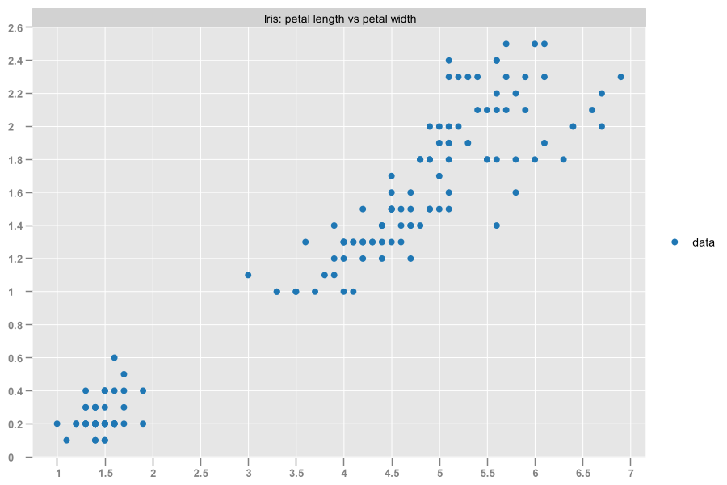
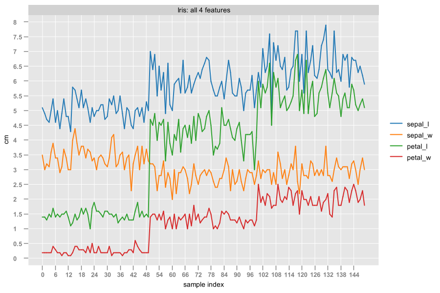
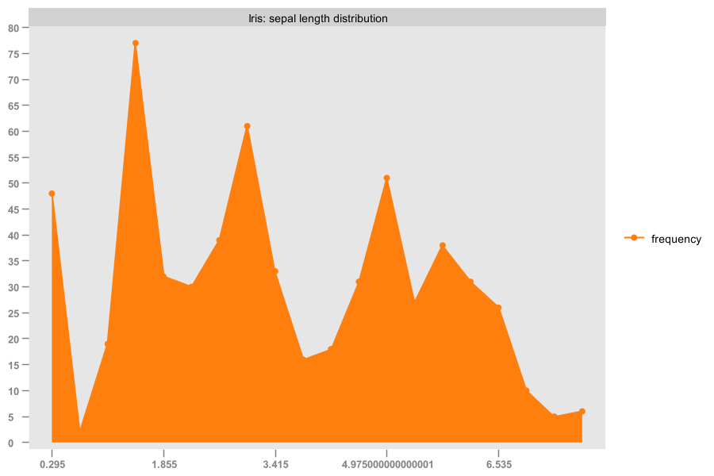

# uni.data

**uni.Mat** is a high-performance, NumPy-compatible matrix library for **Scala 3.7.0+**.

It provides a zero-overhead, type-safe interface for scientific computing by leveraging Scala 3 **Opaque Types**. Designed for developers who need the ergonomics and reproducibility of the Python/NumPy ecosystem within the JVM, `uni.Mat` features 100% faithful implementations of NumPy's random generation and strided array logic.

## Key Features

* **Zero-Overhead Types:** Uses `opaque type Mat[T] = Internal.MatData[T]` to ensure that at runtime, your matrices are as lean as raw arrays, with no wrapper object overhead.
* **NumPy Random Fidelity:** 1:1 behavioral matching for `rand`, `randn`, `uniform`, `randint`, etc. using a high-performance **PCG64** implementation.
* **Strided Memory Layout:** Supports `rowStride` and `colStride`, enabling $O(1)$ `transpose` and zero-copy slicing/views, mirroring NumPy's internal engine.
* **Broadcasting & In-place Ops:** Built-in support for NumPy-style broadcasting and memory-efficient in-place mutation operators (`:+=`, `:-=`, `:*=`, `:/=`).
* **Deep Learning Primitives:** Activation functions (`sigmoid`, `relu`, `softmax`, `leakyRelu`) use parallel fork/join for contiguous matrices — outperforming NumPy's single-core SIMD on multi-core hardware.
* **Pandas-Style Data Analysis:** `head`/`tail`, `shift`/`pct_change`, `rolling`, `describe`, `fillna`, `idxmin`/`idxmax`, `cummax`/`cummin`, `nlargest`/`nsmallest`, `between`, `valueCounts`, and named-column CSV access via `MatResult`.

For high-accuracy scientific modeling or other applications requiring extreme precision, `uni.Mat` provides a `Big` numeric type.

* **High Precision:** [Big Type Guide](docs/BigTypeGuide.md) — Learn about high-precision matrices, and how to use `Mat[Big]`.

## Visualization (`uni.plot`)

`import uni.plot.*` adds `.scatter()`, `.hist()`, and `.plot()` directly on `MatD`.
Each method opens an interactive Swing window, or saves a PNG when `saveTo` is supplied.
Pass a `PlotStyle` to control dimensions, colours, and export consistency.

```scala
#!/usr/bin/env -S scala-cli shebang -Wunused:imports -Wunused:locals -deprecation
//> using dep org.vastblue:uni_3:0.11.0
import uni.data.*
import uni.plot.*

val iris = MatD.readCsv("datasets/iris.csv")
// columns: sepal_length(0), sepal_width(1), petal_length(2), petal_width(3)

iris.scatter(2, 3, title = "Iris: petal length vs petal width")
iris.hist(bins = 20, title = "Iris: sepal length distribution")
iris.plot(title = "Iris: all 4 features",
          labels = Seq("sepal length", "sepal width", "petal length", "petal width"))

// PlotStyle — override only what you need; everything else defers to the GGPlot2 theme
iris.scatter(2, 3, style = PlotStyle(width = 1200, height = 800))
iris.hist(bins = 20, style = PlotStyle(background = Some(java.awt.Color.BLACK),
                                       foreground = Some(java.awt.Color.WHITE)))

// PlotStyle.uniform — identical 800×500 for all saved images
iris.scatter(2, 3, saveTo = "docs/images/iris-scatter", style = PlotStyle.uniform)
iris.hist(bins = 20, saveTo = "docs/images/iris-hist",  style = PlotStyle.uniform)
```

<table><tr>
<!--
<td align="center"><br>Petal length vs petal width <em>Iris</em> clusters</td>
-->
<td align="center"><br>Petal length vs petal width <em>Iris</em> clusters</td>
<td align="center"><br>Sepal length distribution across 150 samples</td>
</tr></table>

See [`jsrc/iris.sc`](jsrc/iris.sc) and [`jsrc/anscombe.sc`](jsrc/anscombe.sc) for runnable demos,
and [Plot Guide](docs/PlotGuide.md) for the full `PlotStyle` API.

## Performance

### Core matrix operations

NumPy: Python 3.14.3 / NumPy 2.4.2 (see [`py/bench.py`](py/bench.py)).
Breeze/MatD: Scala 3.8.2 / JVM 21, both using native OpenBLAS (see [`jsrc/breezeBench.sc`](jsrc/breezeBench.sc)).

| Operation | NumPy | Breeze | MatD |
| :--- | ---: | ---: | ---: |
| `randn(1000×1000)` | 21 ms | 51 ms | 15 ms |
| `matmul 512×512` | 1.4 ms | 1.2 ms | 1.7 ms |
| `sigmoid(1000×1000)` | 12 ms | 11.7 ms | 2.0 ms |
| `relu(1000×1000)` | 2.0 ms | 3.7 ms | 0.8 ms |
| `add(1000×1000)` | 2.1 ms | 1.6 ms | 1.4 ms |
| `sum(1000×1000)` | 0.4 ms | 1.0 ms | 0.5 ms |
| `transpose(1000×1000)` | ≈0 ms | ≈0 ms | ≈0 ms |
| custom fn (`mapParallel` / `map` / `np.vectorize`) | 162 ms | 10.2 ms | 1.0 ms |

MatD wins 6/8 operations vs NumPy and 6/7 scored vs Breeze (geometric mean **3× faster** than Breeze).
Losses: `matmul` (row-major layout requires a pre-transpose before BLAS; Breeze column-major and NumPy's transA/transB flags avoid this cost) and `sum` (NumPy C-extension reduction is marginally faster).

### 3PRF (Three-Pass Regression Filter)

Measured on the same machine (JVM 21 / Scala 3.8.2 vs Python 3.14.3 / NumPy 2.4.2, scipy-openblas).
See [`src/main/scala/apps/Tprf3Bench.scala`](src/main/scala/apps/Tprf3Bench.scala) and [Kelly & Pruitt (2015)](https://doi.org/10.1111/jofi.12246).

| Operation | Python | MatD | Ratio |
| :--- | ---: | ---: | :--- |
| `3PRF IS Full (T=650, N=40, L=2)` | 11 ms | 19 ms | **1.7× slower** |
| `3PRF OOS Recursive (T=650, N=40, L=2)` | 286 ms | 159 ms | **1.8× faster** |
| `3PRF OOS Cross Val (T=650, N=40, L=2)` | 742 ms | 375 ms | **2× faster** |

  | Label | Description |
  | :--- | :--- |
  | IS Full | In-sample fit over the full sample; two vectorized batch solves |
  | OOS Recursive | Expanding-window out-of-sample; re-estimates at each step |
  | OOS Cross Val | Leave-one-out cross-validation across all T windows |

Full results and methodology: [MatD Cheat Sheet — Performance](docs/MatDCheatSheet.md).

## Design Philosophy

uni.Mat is built on the principle that developers shouldn't have to choose between type safety and the ergonomics of NumPy. Its design leverages strides, offsets, and broadcasting for high efficiency—including LAPACK integration—all while maintaining a clean, expression-oriented API.

## Test Coverage

Measured with `sbt jacoco` (1,826 tests). Branch coverage measures both true and false outcomes of every conditional, so it is typically lower than line coverage.
Note: inline annotations were removed before running JaCoCo to prevent Scala 3's per-call-site bytecode duplication — where each call site gets its own branch counters — from artificially lowering reported coverage.

| Package | Branch | Line |
| :--- | ---: | ---: |
| `uni.data` | 70% | 92% |
| `uni.stats` | 32% | 91% |
| `uni.io` | 50% | 83% |
| `uni.time` | 34% | 81% |
| `uni` | 28% | 60% |
| `uni.cli` | 23% | 59% |

## Installation

Add the following to your `build.sbt`:

```scala
libraryDependencies += "org.vastblue" %% "uni" % "0.11.0"
```

## Advanced Usage

* **Quick Start:** [Mat Quick Start Guide](docs/QuickStartGuide.md) — Fast track to NumPy-compatible matrix operations in Scala.
* **Visualization:** [Plot Guide](docs/PlotGuide.md) — `uni.plot` methods, `PlotStyle` configuration, and demo scripts.
* **API Reference:** [Mat Reference Guide](docs/ReferenceGuide.md) — Comprehensive API documentation with validated examples.
* **Cheat Sheet:** [MatD Cheat Sheet](docs/MatDCheatSheet.md) — Side-by-side comparison of MatD vs NumPy, Breeze, R, and MATLAB.
* **High Precision:** [Big Type Guide](docs/BigTypeGuide.md) — High-precision matrices using `MatD[Big]`.

### NumPy to uni.MatD Mapping

| NumPy | uni.MatD | Note |
| :--- | :--- | :--- |
| `a @ b` | `a *@ b` | Matrix multiplication |
| `a * b` | `a * b` | Element-wise product |
| `a[0, :]` | `a(0, ::)` | Row slice |
| `a[:, 0]` | `a(::, 0)` | Column slice |
| `a.T` | `a.T` | $O(1)$ view |
| `np.random.randn(n)` | `MatD.randn(n)` / `MatD.rnorm(n)` | n×1 column vector, standard normal |
| `np.random.randn(r,c)` | `MatD.randn(r, c)` | r×c matrix, standard normal |
| `np.where(c, x, y)` | `MatD.where(c, x, y)` | Conditional selection |
| `np.vstack` / `np.vsplit` | `MatD.vstack` / `m.vsplit(n)` | Row-wise stack / split |

## Quick Start

### Matrix Creation & Randomness

```scala
#!/usr/bin/env -S scala-cli shebang -Wunused:imports -Wunused:locals -deprecation

//> using dep org.vastblue:uni_3:0.11.0

import uni.data.*

// 100% faithful to NumPy's PCG64-based np.random.uniform
MatD.setSeed(42)
val weights = MatD.uniform(low = -0.1, high = 0.1, rows = 64, cols = 32)

// Standard constructors
val zeros    = MatD.zeros(10, 10)
val identity = MatD.eye(5)
val normal   = MatD.randn(10, 10)
println(normal)
```

## Vector Types

`CVec[T]` (column vector, n×1) and `RVec[T]` (row vector, 1×n) are opaque types backed by `Mat[T]`.
They add type-safe BLAS-style vector dispatch on top of `Mat`.

```scala
import uni.data.*

val y: CVecD = CVec(1.0, 2.0, 3.0)   // column vector
val r: RVecD = RVec(4.0, 5.0, 6.0)   // row vector

// Transpose flips column ↔ row
val rt: CVecD = r.T
val yt: RVecD = y.T

// *@ dispatch table
val dot:   Double = y.T *@ y          // RVec *@ CVec  → scalar
val dot2:  Double = y *@ y            // CVec *@ CVec  → scalar (auto-transpose)
val dot3:  Double = r *@ r            // RVec *@ RVec  → scalar (auto-transpose)
val outer: MatD   = y *@ y.T          // CVec *@ RVec  → n×n matrix
val Xy:    CVecD  = X *@ y            // Mat  *@ CVec  → CVec
val yTX:   RVecD  = y.T *@ X         // RVec *@ Mat   → RVec

// Arithmetic
val sum  = y + CVec(0.1, 0.2, 0.3)   // CVec + CVec
val yp1  = y + 1.0                    // CVec + scalar
val ym1  = y - 1.0                    // CVec - scalar
val s2   = 2.0 * y                    // Double * CVec
val si   = 2   * y                    // Int    * CVec
val sl   = 2L  * y                    // Long   * CVec

// Norm, show
val n: Double = y.norm
println(y.show)   // "3x1 CVec[Double]: ..."
```

| CVec factory | |
| :--- | :--- |
| `CVec(1.0, 2.0, 3.0)` | from varargs |
| `CVec.zeros[Double](n)` | n zeros |
| `CVec.ones[Double](n)` | n ones |
| `CVec.fromArray(arr)` | from `Array[T]` |
| `CVec.fromMat(m)` | from n×1 or 1×n `Mat[T]` |

`RVec` has the same factory methods.

## Matrix Type Aliases

To keep your code concise and idiomatic, `uni.MatD` provides type aliases and matching factory objects for supported numeric types.

| Alias | Full Type | Description |
| :--- | :--- | :--- |
| `MatD` | `Mat[Double]` | Standard 64-bit floating point matrix (default) |
| `MatB` | `Mat[Big]` | High-precision, NaN-safe `BigDecimal` matrix |
| `MatF` | `Mat[Float]` | 32-bit floating point matrix for memory efficiency |
| `CVecD` | `CVec[Double]` | Column vector, n×1 |
| `RVecD` | `RVec[Double]` | Row vector, 1×n |

Each alias has a matching factory object mirroring the `MatD` API:

```scala
#!/usr/bin/env -S scala-cli shebang -Wunused:imports -Wunused:locals -deprecation

//> using dep org.vastblue:uni_3:0.11.0

import uni.data.*

val weights:    MatD = MatD.randn(64, 32)
val prices:     MatB = MatB.zeros(10, 1)
val embeddings: MatF = MatF.rand(128, 64)

// Extension method from Big
val preciseVal = 10.5.asBig
val identityB: MatB = MatB.eye(5)
```

## NumPy-like Syntax and Features

### Slicing and Views

```scala
#!/usr/bin/env -S scala-cli shebang -Wunused:imports -Wunused:locals -deprecation

//> using dep org.vastblue:uni_3:0.11.0

import uni.data.*
import uni.data.MatD.*

MatD.setSeed(95)
val data = MatD.randn(100, 10)

// Extract a row or column as a view using the :: sentinel
val row = data(0, ::)    // first row
val col = data(::, 0)    // first column

// Constant-time transpose (no data copy)
val rotated = data.T
println(s"row: $row")
println(s"col: $col")
println(s"rotated: $rotated")
println(s"rotated: ${rotated.show("%7.2f")}")
```

### Mathematical Operations

```scala
#!/usr/bin/env -S scala-cli shebang -Wunused:imports -Wunused:locals -deprecation

//> using dep org.vastblue:uni_3:0.11.0

import uni.data.*

val a = MatD.randn(3, 3)
val b = MatD.randn(3, 3)

val c = a *@ b    // matrix multiplication (matmul)
val d = a + b     // element-wise addition
val e = a * b     // Hadamard (element-wise) product
val f = a.relu    // built-in activation function
```

### In-place Operations

```scala
#!/usr/bin/env -S scala-cli shebang -Wunused:imports -Wunused:locals -deprecation

//> using dep org.vastblue:uni_3:0.11.0

import uni.data.*
import uni.data.MatD.*

val m = MatD.ones(4, 4)
m :+= 2.0    // add scalar in-place
m :-= 1.0    // subtract scalar in-place
m :*= 3.0    // multiply scalar in-place
m :/= 2.0    // divide scalar in-place

val n = MatD.ones(4, 4)
m :+= n      // element-wise add matrix in-place
```

### Boolean Operations

```scala
#!/usr/bin/env -S scala-cli shebang -Wunused:imports -Wunused:locals -deprecation

//> using dep org.vastblue:uni_3:0.11.0

import uni.data.*
import uni.data.MatD.*

val a    = MatD.randn(3, 3)
val mask = (a :== 0) || (a :== 1)    // MatD[Boolean]

val inverted = !mask
val count    = mask.sum    // count of true elements
val anyTrue  = mask.any
val allTrue  = mask.all
```

### Stacking and Splitting

```scala
#!/usr/bin/env -S scala-cli shebang -Wunused:imports -Wunused:locals -deprecation

//> using dep org.vastblue:uni_3:0.11.0

import uni.data.*
import uni.data.MatD.*

val top    = MatD.ones(2, 4)
val bottom = MatD.zeros(2, 4)

val stacked = MatD.vstack(top, bottom)    // 4x4 MatD
val halves  = stacked.vsplit(2)          // Seq of two 2x4 Mats

val left  = MatD.ones(4, 2)
val right = MatD.zeros(4, 2)
val wide  = MatD.hstack(left, right)      // 4x4 MatD
val cols  = wide.hsplit(2)               // Seq of two 4x2 Mats
```

### Display and Formatting

```scala
#!/usr/bin/env -S scala-cli shebang -Wunused:imports -Wunused:locals -deprecation

//> using dep org.vastblue:uni_3:0.11.0

import uni.data.*
import uni.data.MatD.*

val m = MatD.randn(3, 3)

println(m)               // calls toString
println(m.show)          // equivalent, explicit
println(m.show("%.2f"))  // custom format string

// Adjust truncation thresholds for large matrices
MatD.setPrintOptions(maxRows = 20, maxCols = 20, edgeItems = 5)
```

### Usage Example

## Comprehensive Example: MatD in Action

The following example demonstrates a wide array of `uni.MatD` capabilities
, including matrix creation, slicing, broadcasting, linear algebra (SVD, QR, Inverse), and in-place mutation. It illustrates how the library brings NumPy-style ergonomics to Scala while maintaining high performance.

```scala
#!/usr/bin/env -S scala-cli shebang -Wunused:imports -Wunused:locals -deprecation
//> using dep org.vastblue:uni_3:0.11.0

import uni.data.*
import uni.data.MatD.*

object MatDCheck {
  def main(args: Array[String]): Unit = {
    // 1. Creation and Basic Shapes
    val m = MatD.zeros[Double](3, 4)
    val v = MatD.row(1, 2, 3, 4)
    val eye = MatD.eye(2)
    val r = MatD.arange(0, 10, 2)
    val ls = MatD.linspace(0, 1, 5)

    // 2. Arithmetic & Broadcasting
    val result = m + v      // Row-wise broadcasting
    val powr = result ~^ 2  // Power operator
    val matMult = powr *@ v.T // Matrix multiplication (matmul)

    // 3. Math Functions
    val sq = m.sqrt
    val ex = v.exp
    val cl = v.clip(0, 5)

    // 4. Reductions
    val s = m.sum
    val s0 = m.sum(0) // Sum over axis 0
    val mn = m.mean

    // 5. Linear Algebra
    val A = MatD((1, 2), (3, 4))
    val b = MatD.row(5, 6)
    val x = A.solve(b)         // Linear solver
    val inv_A = A.inverse
    val det_A = A.determinant
    val (u, s2, vt) = A.svd    // Singular Value Decomposition
    val (q, r2) = A.qrDecomposition

    // 6. Boolean Masking & Filtering
    val mask = v.gt(1)
    val filtered = v(mask)
    v(v.lt(0)) = 0 // Conditional assignment

    // 7. Slicing & Manipulation
    val sub = m(0 until 2, ::) // Slice rows
    val col = m(::, 0)         // Slice column
    val reshaped = m.reshape(2, 6)
    val transposed = m.T       // O(1) Transpose
    val stacked = MatD.vstack(m, m)

    // 8. Random Generation
    val rand_m = MatD.rand(3, 3)
    val randn_m = MatD.randn(3, 3)

    // 9. In-place Mutation
    m :+= 1
    m :*= 2
    for i <- 0 until 3 do
      m(i, ::) = i * 2
  }
}
```

## Example: Neural Network Layer

Because activation functions are members of the `MatD` type, building layers is idiomatic:

```scala
#!/usr/bin/env -S scala-cli shebang -Wunused:imports -Wunused:locals -deprecation

//> using dep org.vastblue:uni_3:0.11.0

import uni.data.*

def denseLayer(input: MatD, weights: MatD, bias: MatD): MatD = {
  // Simple, readable forward pass
  (input *@ weights + bias).sigmoid
}
```

## Other Features

`uni` also includes utilities that predate `uni.data.MatD` and remain available via `import uni.*`:

* **Scripting Shortcuts:** [Portable Programming Utilities](docs/UniScriptingTools.md) — MSYS2/Cygwin-aware paths, smart date parsing, command-line argument handling, and inline data embedding.
* **Smart Date-Time Parsing:** [Date-Time Parser Guide](docs/DateTimeParser.md) — Autodetect messy dates, configure MDY/DMY preferences, and eliminate ETL regex steps.

### Tolerant Numeric Parsing for Big Data Prep

Raw financial and scientific datasets rarely arrive in clean form. `uni.data.BigUtils` provides `isNumeric` and `getMostSpecificType` that accept the messy formats found in spreadsheets and CSV exports **without requiring pre-cleaning**:

| Raw input | Recognised as |
| :--- | :--- |
| `"$1,234.56"` | `Big(1234.56)` |
| `"(500.00)"` | `Big(-500.00)` — accounting negative |
| `"7.5K"` / `"2.1M"` / `"4B"` | `Big(7500)` / `Big(2_100_000)` / `Big(4_000_000_000)` |
| `"12.5%"` | `Big(0.125)` — already divided by 100 |
| `"-0.042"` | `Big(-0.042)` |
| `"2024-01-15"` | `DateTime` |
| anything else | `String` (passed through unchanged) |

`getMostSpecificType` promotes each raw cell to the most specific type it can without error, so a column of mixed-format numbers loads correctly as `Mat[Big]` in a single pass:

```scala
#!/usr/bin/env -S scala-cli shebang -Wunused:imports -Wunused:locals -deprecation

//> using dep org.vastblue:uni_3:0.11.0

import uni.data.*
import uni.data.BigUtils.*

val raw = Seq("$1,200", "(300)", "1.5K", "0.75%", "N/A", "2024-03-01")
val typed = raw.map(getMostSpecificType)
// => Seq(Big(1200), Big(-300), Big(1500), Big(0.0075), "N/A", DateTime(...))

// Load numeric cells directly into a column vector
val nums = typed.collect { case b: BigDecimal => Big(b) }
val col  = MatB.col(nums*)
```

This eliminates the typical ETL step of writing format-specific regex cleaners before ingestion — particularly valuable when working with multi-source datasets where currency symbols, parenthesised negatives, and scale suffixes appear unpredictably across columns.

---
[CHANGELOG.md](CHANGELOG.md) | © 2026 vastblue.org. Distributed under the Apache License 2.0.