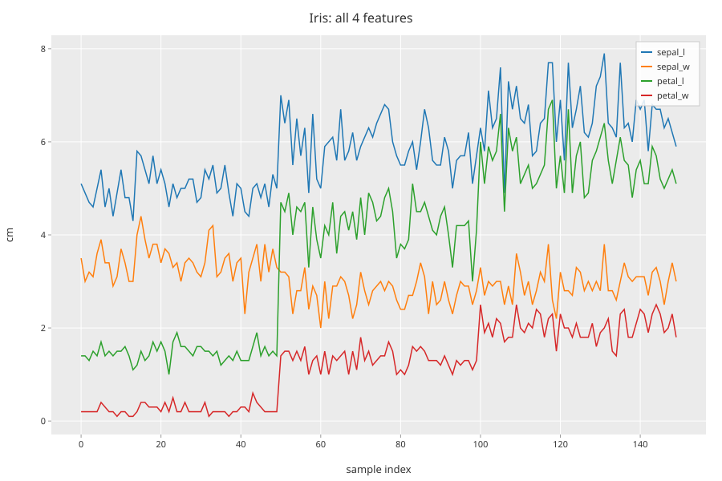
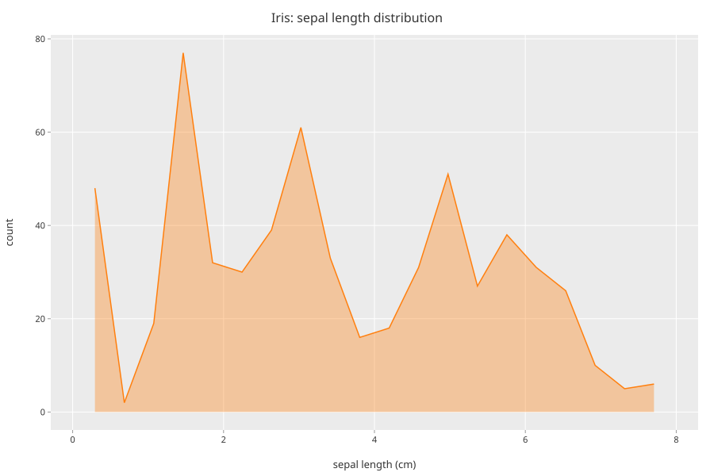

# uni

[](https://central.sonatype.com/artifact/org.vastblue/uni_3)
[](https://crates.io/crates/vastblue-uni)

**uni** is a Scala 3 library and a Rust crate that give the same answers, for numerical
work and the scripting around it:

* **NumPy- and pandas-style matrices** — `MatD` (`Mat[Double]`), with `MatF` and `MatB`
  (`Mat[Float]`, exact-decimal `Mat[Big]`) on the same core: strided views and zero-copy
  slicing, broadcasting, masks, in-place ops, reductions, the linear-algebra and
  decomposition family, `groupBy`/`merge`/`rolling`, and NumPy's random streams draw for
  draw. Zero-overhead: `opaque type Mat[T]` is a raw array at runtime. Same API in Rust.
* **Same results in both languages, pinned not promised** — 3,354 fixture rows generated on
  the JVM and checked by both test suites, so every reduction, view, mask, decomposition
  and pandas-style op answers the same bits in Scala and in Rust.
* **Big-data CSV and scripting tools** — MSYS2/Cygwin-aware paths (92 `Path` extension
  methods, same names in Rust), lenient date-time parsing and arithmetic (`UniDateTime`),
  BigDecimal-compatible `Big` with the `BigNaN` sentinel, tolerant numeric parsing,
  argument handling. Ported in full.
* **Performance** — BLAS-backed or pure-JVM/pure-Rust `matmul`, parallel elementwise ops;
  the benchmark tables below put NumPy, Scala and Rust side by side on the same machines.
* **Charts** — `plot`, `scatter`, `hist`, `bar`, `heatmap`, `boxPlot`, `pairs` on any
  matrix, rendered to SVG by the library itself and opened in the browser or saved; the
  same bytes from both languages, pinned like everything else.
* **3PRF forecasting** — the three-pass regression filter, iterative and closed-form, in
  both languages; a `forecast` demo pair runs the same panel through each.
* **Subprocesses** — `run`/`proc` with the same routing by file extension (`.sh` through
  bash everywhere; `.py`, `.sc`, `.bat`, `.ps1` through their interpreters on Windows), so
  a script line runs unchanged on every OS — in both languages.

Scala 3.7.0+ on the JVM; the Rust crate is `vastblue-uni` (`use uni::…`), no JNI in either
direction.

## The same line in three languages

| | uni Scala | uni Rust | NumPy |
|---|---|---|---|
| Random matrix | `MatD.randn(r, c)` | `MatD::randn(&mut rng, r, c)` | `rng.standard_normal((r, c))` |
| Sub-block | `m(r0 until r1, c0 until c1)` | `m.applyRowsCols(r0..r1, c0..c1)` | `m[r0:r1, c0:c1]` |
| Mask | `m(m > 0.5)` | `m.applyMask(&m.gt(0.5))` | `m[m > 0.5]` |
| Product | `a *@ b` | `a.matmul(&b)` | `a @ b` |
| Broadcast | `m - m.mean(0)` | `&m - &m.meanAxis(0)` | `m - m.mean(0)` |
| SVD | `m.svd` | `m.svd()` | `np.linalg.svd(m, full_matrices=False)` |
| Rolling window | `m.rolling(3).mean` | `m.rolling(3).mean()` | `df.rolling(3).mean()` |
| CSV in | `path.loadMatD` | `path.loadMatD()` | `np.loadtxt(path)` |

The full table — every operation, section for section, with every example compiled and
run — is the **[Scala | Rust | NumPy Cheat Sheet](rust/docs/RustCheatSheet.md)**. The
Rust and Scala columns answer the same bits: 3,354 fixture rows pin them to each other.

## Documentation

| Guide | What it answers |
|---|---|
| **[Scala \| Rust \| NumPy Cheat Sheet](rust/docs/RustCheatSheet.md)** | "how do I write X" — one row per operation, three languages |
| [MatD Cheat Sheet](docs/MatDCheatSheet.md) | the Scala API against NumPy, R and MATLAB |
| [MatD Benchmarks](docs/MatDBenchmarks.md) | NumPy vs Scala vs Rust on three operating systems, and how to regenerate the tables |
| [Breeze Comparison](docs/BreezeComparison.md) | coming from Breeze: the migration table, every operation side by side, benchmarks |
| [Quick Start Guide](docs/QuickStartGuide.md) · [Rust Quick Start](rust/docs/RustQuickStart.md) | first program to `groupBy` in twenty short sections |
| [Reference Guide](docs/ReferenceGuide.md) | the Scala matrix API, section by section |
| [Big Type Guide](docs/BigTypeGuide.md) | exact decimals: `Big`, `BigNaN`, `MatB` |
| [Scripting Tools](docs/UniScriptingTools.md) · [Rust Scripting Guide](rust/docs/RustScriptingGuide.md) | paths, CSV, dates, arguments — for scripts |
| [Choosing your own world](docs/MarketSimWorlds.md) | `marketSim`: which dials exist, what each one actually moves, and when the world matters |
| [Date-Time Parser](docs/DateTimeParser.md) · [Path I/O Reference](docs/PathIOReference.md) · [Plot Guide](docs/PlotGuide.md) · [Subprocess API](docs/SubprocessAPI.md) | one topic each |

Every ```scala block in these pages is a complete script that the CI compiles and runs;
every ```rust block likewise.

## Key Features

* **Zero-Overhead Types:** Uses `opaque type Mat[T] = Internal.MatData[T]` to ensure that at runtime, your matrices are as lean as raw arrays, with no wrapper object overhead.
* **NumPy Random Fidelity:** 1:1 behavioral matching for `rand`, `randn`, `uniform`, `randint`, etc. using a high-performance **PCG64** implementation.
* **Strided Memory Layout:** Supports `rowStride` and `colStride`, enabling $O(1)$ `transpose` and zero-copy slicing/views, mirroring NumPy's internal engine.
* **Broadcasting & In-place Ops:** Built-in support for NumPy-style broadcasting and memory-efficient in-place mutation operators (`:+=`, `:-=`, `:*=`, `:/=`).
* **Deep Learning Primitives:** Activation functions (`sigmoid`, `relu`, `softmax`, `leakyRelu`) use parallel fork/join for contiguous matrices — outperforming NumPy's single-core SIMD on multi-core hardware.
* **Pandas-Style Data Analysis:** `head`/`tail`, `shift`/`pct_change`, `rolling`, `describe`, `fillna`, `idxmin`/`idxmax`, `cummax`/`cummin`, `nlargest`/`nsmallest`, `between`, `valueCounts`, and named-column CSV access via `MatResult`.

For high-accuracy scientific modeling or other applications requiring extreme precision, `uni.Mat` provides a `Big` numeric type.

* **High Precision:** [Big Type Guide](docs/BigTypeGuide.md) — Learn about high-precision matrices, and how to use `Mat[Big]`.

## Rust companion crate (`rust/`)

The `rust/` directory holds **`uni` for Rust**: a standalone crate (no JNI — nothing in the
Scala library calls into it) that ports the library's scripting surface and its numerics, so
the same script logic can run outside the JVM and each implementation serves as the other's
independent second opinion. Since 0.16.0 it covers the whole path/time/decimal API; as of
0.17.0 the `Mat[Double]` port is complete as well — the view model, reductions, masks and
indexing, elementwise math, matmul, the linear-algebra and decomposition family, pandas-style
and signal ops, `groupBy`/`merge` — and `MatB` (`Mat[Big]`, exact decimals) and `MatF`
(`Mat[Float]`) followed on the same generic core, all pinned to the JVM by a fixture of
3,354 rows.

The crate has its own guides, parallel to the ones below section for section and with every
example compiled: [`rust/docs/RustQuickStart.md`](rust/docs/RustQuickStart.md),
[`rust/docs/RustCheatSheet.md`](rust/docs/RustCheatSheet.md) (uni Scala | uni Rust | NumPy),
[`rust/docs/RustScriptingGuide.md`](rust/docs/RustScriptingGuide.md).

**Method names match the Scala spelling** — `baseName`, `lastModifiedTime`, `parseDateSmart` —
so a line written against the Scala ports unchanged. CamelCase means "this mirrors uni's
API"; snake_case means an internal helper or a `try_*` Result variant, so the case tells you
whether a Scala counterpart exists (the same convention `windows-rs` uses for Win32 names).

What is covered, with **no dependency** taken for any of it:

* **`upath`** — every one of the 92 `Path` extension methods, same names, same semantics:
  path forms and mount handling, metadata, lazy and ordered traversal, mutation with the
  same collision answers, line reading with the same carriage-return rule, CSV parsing and
  the matrix loaders, hashing. See `docs/PathIOReference.md` for the per-method table and
  the deliberate differences (error shape, `canExecute` on Windows).
* **`utime`** — `UniDateTime` (field arithmetic via Hinnant's civil-calendar algorithms),
  the pattern formatter, and `SmartParse`, the format-autodetecting date parser. See
  `docs/DateTimeParser.md`.
* **`udata`** — `Big`, an arbitrary-precision decimal with `java.math.BigDecimal` semantics
  (exact `+`/`-`/`*` under each value's MathContext, DECIMAL128-rounded `/` and `sqrt`, the
  equality-recognised BigNaN sentinel), backing the `Big` CSV loaders. See
  `docs/BigTypeGuide.md`.
* **`uplot`** — the seven chart types, rendered to SVG by the crate itself; the same bytes
  as `uni.plot` (98 fixture rows). See `docs/PlotGuide.md`.
* **`uproc`** — `run`/`proc`/`ProcResult`/`ProcBuilder` and the `bashExe`/`pythonExe`/
  `whereInPath`/`uname` family with Scala's routing table; `where` is `whereExe` (a Rust
  keyword) and `failFast`/`orFail` is `?` on `orFail`'s `Result`. See
  `docs/SubprocessAPI.md`.
* **Bit-identical NumPy random numbers.** `NumPyRng` reproduces
  `np.random.default_rng(seed)` — PCG64 XSL RR 128 behind NumPy's SeedSequence expansion —
  and therefore also reproduces `uni.data.NumPyRNG` draw for draw. `randn` too, via the same
  256-layer Ziggurat; against the JVM it differs on ~2.5 tail draws per million by exactly
  one ulp (`log1p` rounding), never a control-flow divergence.
* **3PRF** (`estimate_3prf_is_full`, `_oos_rec`, `_oos_cv`) — the same three procedures as
  `uni.stats.Tprf3`, in the `t3prf` module the crate was originally named for.

### Parity is pinned, not promised

Two independent mechanisms, because they catch different things.

**1. Committed fixtures — per-method values.** Ten files under `test-data/*-parity/` hold
roughly 20,600 rows of the Scala side's own answers (with `java.time`,
`java.math.BigDecimal` and NumPy as the transitive oracles): path 10,535 · date 4,173 ·
tprf3 3,039 · big 633 · smartparse 539 · csv 458 · numpy-rng 378 · walk 30 · hash 23. A
Scala suite and a Rust test each check themselves against the same file, so **neither
language needs the other installed** — and CI runs both. Regenerate only when the
expectations are meant to move (`sbt "runMain uni.apps.PathParityGen"`, and the
`*ParityGen` siblings).

Because `PathContext` takes `is_windows` as *data*, the Rust side verifies the **Windows**
rule set from Linux and macOS too — the Scala suite cannot, since its `isWin` comes from
`os.name`. That asymmetry is why the path fixture is split by platform.

**2. Matched demo pairs — composition, and documentation that cannot rot.** Fixtures pin
one method at a time; a method with no fixture is pinned by nothing, and *sequences* of
calls are pinned by nothing either. So each demo below exists twice — `jsrc/<name>.sc` and
`rust/examples/<name>.rs`, written to read line-for-line alike — and the two print
**byte-identical output**, which `diff` checks:

| pair | what it demonstrates | output |
| :--- | :--- | :--- |
| `pairProbe` | ~50 metadata and mutation operations on identical trees, including collision answers and status codes | identical per machine |
| `treestat` | a real tool: walk a tree, aggregate sizes by extension, bucket file ages, digest the largest file (`hash64`/`cksum`/`md5`/`sha256`), sample deterministically, round-trip a CSV | identical per machine |
| `pathshow` | every path rendering (`posx`/`localpath`/`dospath`/`relpath`/`stdpath`/`posix`/`segments`/…), mount-table resolution, drive-relative forms, the BadPath family, the `String` extensions | identical per machine |
| `datecalc` | the date surface on **fixed** inputs: smart parsing incl. day-first configuration, the shift and `with*` families, epoch-day round trips, the between/duration family, sentinels | identical **everywhere, any day** |
| `bigcalc` | the decimal surface as an exact-money invoice: `str2num`/`isNumeric`, arithmetic, every rounding mode, `numStr`/`numStrPct`, the BigNaN sentinel; then the same invoice as a `MatB` — elementwise ops, `matmul`, folds, masks, exact-decimal LU | identical **everywhere** |
| `forecast` | seeded `randn` → byte-identical CSV → `loadMatBig` → the 3PRF closed forms and `forecast3prf` (in-sample and both OOS procedures) | identical per machine |
| `marketSim` | the odd one out: a 1,300-line workload rather than an API tour. Seeded price formation over 200 paths × 100 years, `MatD` reductions, drawdown episodes, exposure rules with a two-heap running median, and five report modes (`-emit`/`-validate`/`-strategies`/`-power`/`-buffer`) plus `-calibrate` | identical **everywhere** |
| `matdcalc` | the `MatD` core on one seeded matrix — views, broadcasting, reductions, the pinned matmul, masks, exact linalg, pandas-style ops, stacking, CSV — `jsrc/matdcalc.sc` ↔ `rust/examples/matdcalc.rs`, written to read line for line alike | identical **everywhere** |
| `tprfRunner` | `TprfRunner.data_generator`: four `update` recurrences (the mutation idiom `MatMut` exists for), `hstack`, `factors.matmulPure(factor_loadings)` — the **pinned matmul**, the same loop on both sides — and the noise blend; every cell of `X` printed | identical **everywhere** |

Five of the pairs are machine-independent by construction (fixed inputs, no filesystem, no
clock), so they double as portable acceptance tests; the rest agree on any one machine
because they read the same tree. `marketSim` is machine-independent only because the
matrix reductions it leans on are: `Mat.sumD` splits large sums into a chunk count fixed
by *length*, never by `availableProcessors`, so the association order — and with it the
last bit of every sum — cannot vary with the host. `tprfRunner` adds the matmul to that
list: `matmulPure` is a tiled loop whose per-cell association order is a sequential
k-sum, and neither runtime fuses multiply-adds, so it is machine-independent too. The
default `*@` is not: like NumPy's `@` it goes to a native BLAS (2–4× faster on large dense
products, but kernel- and thread-dependent in the last ulps), which is why the pair names
the pinned loop explicitly, and why `-Duni.mat.blas=pure` exists for whole programs.

Float rendering is pinned rather than inherited: the earlier pairs print through
`Big` + `numStr`, and `marketSim` through `java_format_f`, which reproduces Java's
`%f` (shortest decimal, rounded half-up) because Rust's `{:.6}` rounds the exact binary
value half-to-even and the two disagree on boundary cases. Either way, platform float
formatting cannot leak in.

```bash
# run a pair and compare
scala-cli run jsrc/bigcalc.sc                      > scala.out
cargo build --manifest-path rust/Cargo.toml --example bigcalc
rust/target/debug/examples/bigcalc                 > rust.out
diff scala.out rust.out          # expect no output
```

Full catalogue, the determinism techniques, and how to add a pair:
[docs/DemoPairs.md](docs/DemoPairs.md).

These pairs have earned their keep: they surfaced `canRead`/`canExecute` answering `false`
for directories on Windows, a `mkdirs` that threw on one side, an `is_absolute` that applied
the Windows root rule under POSIX rules, and two genuine API divergences that were then
**fixed rather than documented** — `sqrt` of a negative and a negative `pow` exponent now
answer `BigNaN` in both languages (Scala used to throw), and those rows are pinned.

```bash
cd rust && make all          # test, fmt, clippy, file-size check
```

Every benchmark in the docs — MatD and 3PRF, NumPy vs Scala vs Rust, with and without
BLAS — is one table per platform, regenerated by one command that prints finished
markdown:

```bash
./runBenchAll.sh
```

It builds both Rust flavours (default and `--features blas`) side by side and runs
`uni.apps.BenchAll`, which lays out five columns — `NumPy | Scala | Rust | Scala·BLAS |
Rust·BLAS` — so NumPy (always OpenBLAS) is compared with each port in *both* of its
modes, and finishes with a geometric-mean/median summary of every pair. Each column
carries a provenance line, and a missing binary drops its column rather than the run.
See the regeneration note in [docs/MatDBenchmarks.md](docs/MatDBenchmarks.md).

## Visualization (`uni.plot`)

`import uni.plot.*` adds `.plot()`, `.scatter()`, `.hist()`, `.bar()`, `.heatmap()`,
`.boxPlot()` and `.pairs()` directly on `MatD`. Each renders to SVG — drawn by the library,
no charting dependency — and shows it in a standalone window of your default browser
(`UNI_PLOT_WINDOW=tab` for a tab), or saves it when `saveTo` is supplied (`<name>.svg`,
or `.html`). Pass a `PlotStyle` to control dimensions, colours,
labels and log axes. The Rust crate's `uni::uplot` produces the same SVG bytes; see
[docs/PlotGuide.md](docs/PlotGuide.md).

```scala
#!/usr/bin/env -S scala-cli shebang -Wunused:imports -Wunused:locals -deprecation
//> using dep org.vastblue:uni_3:0.20.0
import uni.data.*
import uni.plot.*
// doc: compile-only  (opens the browser; run from the repo root for datasets/)

val iris = MatD.readCsv("datasets/iris.csv")
// columns: sepal_length(0), sepal_width(1), petal_length(2), petal_width(3)

iris.scatter(2, 3, title = "Iris: petal length vs petal width")
iris.hist(bins = 20, title = "Iris: sepal length distribution")
iris.plot(title = "Iris: all 4 features",
          labels = Seq("sepal length", "sepal width", "petal length", "petal width"))

// PlotStyle — override only what you need; everything else defers to the theme
iris.scatter(2, 3, style = PlotStyle(width = 1200, height = 800))
iris.hist(bins = 20, style = PlotStyle(background = Some(java.awt.Color.BLACK),
                                       foreground = Some(java.awt.Color.WHITE)))

// PlotStyle.uniform — identical 800×500 for all saved images
iris.scatter(2, 3, saveTo = "docs/images/iris-scatter", style = PlotStyle.uniform)
iris.hist(bins = 20, saveTo = "docs/images/iris-hist",  style = PlotStyle.uniform)
```

<table><tr>
<td align="center"><br>All four <em>Iris</em> features over the 150 samples</td>
<td align="center"><br>Sepal length distribution across 150 samples</td>
</tr></table>

See [`jsrc/iris.sc`](jsrc/iris.sc) and [`jsrc/anscombe.sc`](jsrc/anscombe.sc) for runnable demos,
and [Plot Guide](docs/PlotGuide.md) for the full `PlotStyle` API.

## Performance

### Core matrix operations

Geometric-mean speedup over the benchmark rows, BLAS on all three (NumPy is always
OpenBLAS; Scala and Rust use theirs on the rows BLAS affects). Above 1× means the
first-named is faster.

| OS | Scala vs NumPy | Rust vs NumPy | Rust vs Scala |
|---|---:|---:|---:|
| Windows 11 | 3.15× | 3.79× | 1.30× |
| Linux (WSL2, same machine) | 1.80× | 1.66× | 0.99× |
| macOS | 1.38× | 2.09× | 1.65× |

The per-operation tables — NumPy | Scala·pure | Rust·pure | Scala·BLAS | Rust·BLAS on all
three operating systems, regenerated by one command — are in
[`docs/MatDBenchmarks.md`](docs/MatDBenchmarks.md); the Breeze
comparison is in [`docs/BreezeComparison.md`](docs/BreezeComparison.md).

### 3PRF (Three-Pass Regression Filter)

Measured on Windows 11 (uni 0.15.1+ / JVM 22 / Scala 3.8.4, vs Python 3.13.13 / NumPy
on scipy-openblas, and the `t3prf` Rust crate on OpenBLAS; medians of 25 timed calls
per OOS procedure after explicit warm-up). See [`jsrc/tprf3Bench.sc`](jsrc/tprf3Bench.sc),
[`rust/src/bin/bench_tprf3.rs`](rust/src/bin/bench_tprf3.rs) and
[Kelly & Pruitt (2015)](https://doi.org/10.1111/jofi.12246).

Through v0.14.1 both implementations were kept equivalently optimized, so published
ratios compared equivalent algorithms: v0.14.0 rewrote the K&P `J(k)` centering
products as O(T·N) centering on both sides, and v0.14.1 tuned both again — Python's
three `lstsq` passes became normal-equations solves and its std/mean paths are
NaN-gated; Scala's OOS windows gained fused, copy-free standardization.

v0.15.1 tuned the Scala side only, which briefly made the OOS rows a comparison
between differently-optimized algorithms. **Those three techniques are now applied
to NumPy as well**, so the OOS comparison is back to being like-for-like: both
sides push the column scaling onto an (L+1)-column operand instead of materializing
`X·D⁻¹`, run pass 2 in natural order, and derive each window's pass-1 cross
products — and the per-window column std — by downdating full-sample ones. The
same three are in the Rust port. For a Cross Val window dropping a single row,
downdating turns pass 1 from O(T·N·L) into O(N·L).

NumPy keeps the direct per-window path where the downdate does not apply:
autoproxy rebuilds the proxies each inner iteration, so there is nothing to
precompute, and the downdates have no NaN-aware form. OOS Rolling is excluded for
a different reason — its kept set is the short window itself, so a direct pass is
already the cheap side.

| Operation | Python | MatD | Rust | Py/MatD | MatD/Rust |
| :--- | ---: | ---: | ---: | :--- | :--- |
| `3PRF IS Full (T=650, N=40, L=2)` | 0.27 ms | 0.202 ms | 0.051 ms | **1.3× faster** | **4.0× faster** |
| `3PRF OOS Recursive (T=650, N=40, L=2)` | 21.7 ms | 1.646 ms | 1.42 ms | **13.2× faster** | **1.2× faster** |
| `3PRF OOS Cross Val (T=650, N=40, L=2)` | 38.6 ms | 5.735 ms | 2.06 ms | **6.7× faster** | **2.8× faster** |

Porting those optimizations to NumPy moved OOS Cross Val from 84.3 to 38.6 ms and
OOS Recursive from 30.6 to 21.7 ms, which halved MatD's lead on Cross Val — it read
13.6× against the un-ported NumPy and reads 6.7× against the ported one. That
difference is the measure of how much of the earlier gap was algorithm rather than
language.

Python and MatD come from one run of [`uni.apps.Tprf3Bench`](src/main/scala/apps/Tprf3Bench.scala),
which measures both in the same process, so the Py/MatD ratios are internally
consistent rather than spliced across sessions. The Rust column is from a
`--features blas` build measured separately — see below for why that is the right
baseline. That run's pure-Rust figures (3.54 / 4.51 ms on the two OOS rows) sit
within 5% of the pure-Rust column this run produced (3.69 / 4.31 ms), which is the
check that the two sessions are comparable at all.

Earlier releases published median-of-3 figures for the two-way comparison; those
read 0.31 / 0.36 ms for IS Full, 31.8 / 1.8 ms for OOS Recursive and 88.9 / 7.1 ms
for OOS Cross Val.

**All three languages now run on bit-identical input matrices** — each seeds a
NumPy-compatible PCG64 with 0 and draws X, y, Z in that order, so the table
measures implementations and not a mix of implementation and input. Until the Rust
bench moved to `NumPyRng` it generated its own inputs from `StdRng` and a
Box–Muller transform.

The Rust column is a `--features blas` build, which is the like-for-like
comparison: MatD runs on JNIBLAS-backed native OpenBLAS (the benchmark log names
it), so a default pure-Rust build is not the right baseline. Pure-Rust reads
0.052 / 3.69 / 4.31 ms on the same rows — roughly 2.3× slower on both OOS
procedures, enough to turn OOS Recursive from a 1.2× win into a 2.2× loss, because
those gemms are skinny (one operand has only `L+1` columns) and `matrixmultiply`
handles that shape poorly. It reverses at the small size, where BLAS call overhead
outweighs the kernel win: at T=200/N=30 OOS Recursive is *faster* pure-Rust
(0.38 vs 0.51 ms). Neither build dominates, so the benchmark prints its `config:`
line and any quoted figure should say which build it is.

IS Full stays close — both sides reduce to the same two batch solves. Measured in
isolation MatD runs 0.25 ms; the figure above comes from a full benchmark run,
where it shares JIT call-site profiles with the OOS procedures.

The Linux and macOS tables below predate the Rust port and carry no Rust column;
the crate has not been benchmarked on those platforms.

Linux (Intel Core i5-6500, Ubuntu 24.04, vs Python 3.12.3 / system OpenBLAS):

| Operation | Python | MatD | Ratio |
| :--- | ---: | ---: | :--- |
| `3PRF IS Full (T=650, N=40, L=2)` | 3.1 ms | 0.46 ms | **6.6× faster** |
| `3PRF OOS Recursive (T=650, N=40, L=2)` | 330 ms | 47 ms | **7.0× faster** |
| `3PRF OOS Cross Val (T=650, N=40, L=2)` | 862 ms | 86 ms | **10.0× faster** |

macOS (Apple Silicon, vs Python 3.14.6):

| Operation | Python | MatD | Ratio |
| :--- | ---: | ---: | :--- |
| `3PRF IS Full (T=650, N=40, L=2)` | 0.79 ms | 0.22 ms | **3.6× faster** |
| `3PRF OOS Recursive (T=650, N=40, L=2)` | 171 ms | 22 ms | **7.8× faster** |
| `3PRF OOS Cross Val (T=650, N=40, L=2)` | 447 ms | 48 ms | **9.2× faster** |

  | Label | Description |
  | :--- | :--- |
  | IS Full | In-sample fit over the full sample; two vectorized batch solves |
  | OOS Recursive | Expanding-window out-of-sample; re-estimates at each step |
  | OOS Cross Val | Leave-one-out cross-validation across all T windows |

Full results and methodology: [MatD Benchmarks](docs/MatDBenchmarks.md).

## Design Philosophy

uni.Mat is built on the principle that developers shouldn't have to choose between type safety and the ergonomics of NumPy. Its design leverages strides, offsets, and broadcasting for high efficiency—including LAPACK integration—all while maintaining a clean, expression-oriented API.

### No element boxing — by construction, not by convention

A generic JVM matrix `Mat[T]` stores its data in an `Array[T]` that erases to `Object[]`, so the natural `m(i, j)` element read and `m(i, j) = v` write would box every value into a `java.lang.Double`/`java.lang.Float`. uni avoids this **without asking the client to learn a special "fast" accessor**: for the two numeric workhorses, `MatD` (`Mat[Double]`) and `MatF` (`Mat[Float]`), the entire indexing family — scalar access and assignment, row/column/range slices, boolean masking, fancy `Array[Int]` indexing, and slice assignment — is supplied in a type-specialized form that reads and writes the primitive backing array directly.

So ordinary client code written the obvious way is already allocation-free for the element value:

```scala
#!/usr/bin/env -S scala-cli shebang -Wunused:imports -Wunused:locals -deprecation

//> using dep org.vastblue:uni_3:0.20.0

import uni.data.*

val m = MatD((1.0, 2.0, 3.0), (4.0, 5.0, 6.0))
val x = m(0, 1)        // primitive double load — no java.lang.Double allocated
m(1, 2) = 99.0         // primitive double store
m(0, ::) = 0.0         // slice assignment, also unboxed
println(s"$x ${m(1, 2)} ${m(0, ::).sum}")   // 2.0 99.0 0.0
```

This is verified at the bytecode level (primitive `daload`/`dastore`, no `Double.valueOf`) and confirmed end-to-end by JFR allocation profiling, which shows zero boxed-scalar allocations on the element path. The `MatF` specialization is generated from the `MatD` source by the build, so the two never drift.

Note the scope: this covers the element **value** type on `MatD`/`MatF`. Other element types (`Mat[Int]`, `Mat[Big]`, …) still box element access — an inherent cost of generic JVM arrays — and a few collection-iteration paths box loop *indices* (`Int`), which is unrelated to the numeric data.

## Test Coverage

Measured with `sbt jacoco` (1,980 tests). Branch coverage measures both true and false outcomes of every conditional, so it is typically lower than line coverage.
Note: inline annotations were removed before running JaCoCo to prevent Scala 3's per-call-site bytecode duplication — where each call site gets its own branch counters — from artificially lowering reported coverage.

| Package | Branch | Line |
| :--- | ---: | ---: |
| `uni.data` | 70% | 92% |
| `uni.stats` | 32% | 91% |
| `uni.io` | 50% | 83% |
| `uni.time` | 34% | 81% |
| `uni` | 28% | 60% |
| `uni.cli` | 23% | 59% |

## Installation

Add the following to your `build.sbt`:

```scala
libraryDependencies += "org.vastblue" %% "uni" % "0.20.0"
```

### Native BLAS backend

`*@` / `matmul` / `dot` route large products to a native BLAS by default, as NumPy does.
`-Duni.mat.blas` (or the env var `UNI_MAT_BLAS`; the property wins; read once per JVM,
no programmatic setter) picks which:

| value | meaning |
|-------|---------|
| unset, `os-best`, `true` | **default.** `system` wherever netlib binds a native BLAS — Accelerate on macOS, the OS OpenBLAS on Linux (`sudo apt install libopenblas0`) and Windows — else `bundled` |
| `system` | netlib → the OS BLAS. On Linux the LAPACK routines (`eig`, `eigenvalues`, `svd`, `cholesky`) then go through netlib's LAPACK too — the OS `liblapack.so.3`, or its pure-Java fallback |
| `bundled` | bytedeco's OpenBLAS for everything; needs no OS packages, 2–4.5× slower than the system OpenBLAS at 512³ |
| `pure`, `false` | no BLAS: every `*@` is `uni`'s pinned loop — bit-identical between the Scala and Rust ports and independent of the machine |

Per call, whatever the mode: `a.matmulPure(b)` is the pinned loop and `a.matmulBlas(b)`
is BLAS. Products below a few hundred flops take the pinned loop in every mode.

Why the Linux modes are exclusive: Ubuntu's `libopenblas0` shares the bundled OpenBLAS's
SONAME and is built without LAPACKE; two OpenBLAS instances in one JVM interpose on each
other and kill the process. `uni` therefore never maps both — `system` uses only the OS
libraries, `bundled` only bytedeco's — and nothing needs to be purged from the OS.
(`inverse` is a pure-JVM LU.) `-Duni.blas.verbose=true` prints which backend was bound.

## Advanced Usage

* **Quick Start:** [Mat Quick Start Guide](docs/QuickStartGuide.md) — Fast track to NumPy-compatible matrix operations in Scala.
* **Visualization:** [Plot Guide](docs/PlotGuide.md) — `uni.plot` methods, `PlotStyle` configuration, and demo scripts.
* **API Reference:** [Mat Reference Guide](docs/ReferenceGuide.md) — Comprehensive API documentation with validated examples.
* **Cheat Sheet:** [MatD Cheat Sheet](docs/MatDCheatSheet.md) — Side-by-side comparison of MatD vs NumPy, R, and MATLAB.
* **Breeze:** [Breeze Comparison](docs/BreezeComparison.md) — migration table, operation-by-operation cheat sheet, and benchmarks against Breeze.
* **High Precision:** [Big Type Guide](docs/BigTypeGuide.md) — High-precision matrices using `MatB` (`Mat[Big]`).
* **Path & I/O Reference:** [Path/String/File Extensions](docs/PathIOReference.md) — Complete extension method reference for `Path`, `JFile`, and `String`.

### NumPy to uni.MatD Mapping

| NumPy | uni.MatD | Note |
| :--- | :--- | :--- |
| `a @ b` | `a *@ b` | Matrix multiplication |
| `a * b` | `a * b` | Element-wise product |
| `a[0, :]` | `a(0, ::)` | Row slice |
| `a[:, 0]` | `a(::, 0)` | Column slice |
| `np.apply_along_axis(f, 0, a)` | `a.eachCol.map(f)` | Apply f to each column |
| `np.apply_along_axis(f, 1, a)` | `a.eachRow.map(f)` | Apply f to each row |
| `a.reshape(r, c)` | `a.reshape(r, c)` | Change shape |
| `a.T` | `a.T` | $O(1)$ view |
| `np.random.randn(n)` | `MatD.randn(n)`<br>`MatD.rnorm(n)` | n×1 column vector, standard normal |
| `np.random.randn(r,c)` | `MatD.randn(r, c)` | r×c matrix, standard normal |
| `np.where(c, x, y)` | `MatD.where(c, x, y)` | Conditional selection |
| `np.vstack(...)` | `MatD.vstack(...)` | Row-wise stack |
| `np.vsplit(m, n)` | `m.vsplit(n)` | Row-wise split |
| `m.item()` | `m.item` | Extract scalar from 1×1 matrix |

## Quick Start

### Matrix Creation & Randomness

```scala
#!/usr/bin/env -S scala-cli shebang -Wunused:imports -Wunused:locals -deprecation

//> using dep org.vastblue:uni_3:0.20.0

import uni.data.*

// 100% faithful to NumPy's PCG64-based np.random.uniform
MatD.setSeed(42)
val weights = MatD.uniform(low = -0.1, high = 0.1, rows = 64, cols = 32)

// Standard constructors
val zeros    = MatD.zeros(10, 10)
val identity = MatD.eye(5)
val normal   = MatD.randn(10, 10)
println(normal)
```

## Vector Types

`CVec[T]` (column vector, n×1) and `RVec[T]` (row vector, 1×n) are opaque types backed by `Mat[T]`.
They add type-safe BLAS-style vector dispatch on top of `Mat`.

```scala
#!/usr/bin/env -S scala-cli shebang -Wunused:imports -Wunused:locals -deprecation

//> using dep org.vastblue:uni_3:0.20.0

import uni.data.*

val y: CVecD = CVec(1.0, 2.0, 3.0)   // column vector
val r: RVecD = RVec(4.0, 5.0, 6.0)   // row vector
val X: MatD  = MatD.eye(3)

// Transpose flips column ↔ row
val rt: CVecD = r.T
val yt: RVecD = y.T

// *@ dispatch table
val dot:   Double = y.T *@ y          // RVec *@ CVec  → scalar
val dot2:  Double = y *@ y            // CVec *@ CVec  → scalar (auto-transpose)
val dot3:  Double = r *@ r            // RVec *@ RVec  → scalar (auto-transpose)
val outer: MatD   = y *@ y.T          // CVec *@ RVec  → n×n matrix
val Xy:    CVecD  = X *@ y            // Mat  *@ CVec  → CVec
val yTX:   RVecD  = y.T *@ X         // RVec *@ Mat   → RVec

// Arithmetic
val sum  = y + CVec(0.1, 0.2, 0.3)   // CVec + CVec
val yp1  = y + 1.0                    // CVec + scalar
val ym1  = y - 1.0                    // CVec - scalar
val s2   = 2.0 * y                    // Double * CVec
val si   = 2   * y                    // Int    * CVec
val sl   = 2L  * y                    // Long   * CVec

// Norm, show
val n: Double = y.norm
println(y.show)   // "3x1 CVec[Double]: ..."
println(s"$dot $dot2 $dot3 ${outer.shape} ${Xy.shape} ${yTX.shape} ${rt.shape} ${yt.shape}")
println(s"${sum.sum} ${yp1.sum} ${ym1.sum} ${s2.sum} ${si.sum} ${sl.sum} $n")
```

| CVec factory | |
| :--- | :--- |
| `CVec(1.0, 2.0, 3.0)` | from varargs |
| `CVec.zeros[Double](n)` | n zeros |
| `CVec.ones[Double](n)` | n ones |
| `CVec.fromArray(arr)` | from `Array[T]` |
| `CVec.fromMat(m)` | from n×1 or 1×n `Mat[T]` |

`RVec` has the same factory methods.

## Matrix Type Aliases

To keep your code concise and idiomatic, `uni.MatD` provides type aliases and matching factory objects for supported numeric types.

| Alias | Full Type | Description |
| :--- | :--- | :--- |
| `MatD` | `Mat[Double]` | Standard 64-bit floating point matrix (default) |
| `MatB` | `Mat[Big]` | High-precision, NaN-safe `BigDecimal` matrix |
| `MatF` | `Mat[Float]` | 32-bit floating point matrix for memory efficiency |
| `CVecD` | `CVec[Double]` | Column vector, n×1 |
| `RVecD` | `RVec[Double]` | Row vector, 1×n |

Each alias has a matching factory object mirroring the `MatD` API:

```scala
#!/usr/bin/env -S scala-cli shebang -Wunused:imports -Wunused:locals -deprecation

//> using dep org.vastblue:uni_3:0.20.0

import uni.data.*

val weights:    MatD = MatD.randn(64, 32)
val prices:     MatB = MatB.zeros(10, 1)
val embeddings: MatF = MatF.rand(128, 64)

// Extension method from Big
val preciseVal = 10.5.asBig
val identityB: MatB = MatB.eye(5)
```

## NumPy-like Syntax and Features

### Slicing and Views

```scala
#!/usr/bin/env -S scala-cli shebang -Wunused:imports -Wunused:locals -deprecation

//> using dep org.vastblue:uni_3:0.20.0

import uni.data.*

MatD.setSeed(95)
val data = MatD.randn(100, 10)

// Extract a row or column as a view using the :: sentinel
val row = data(0, ::)    // first row
val col = data(::, 0)    // first column

// Constant-time transpose (no data copy)
val rotated = data.T
println(s"row: $row")
println(s"col: $col")
println(s"rotated: $rotated")
println(s"rotated: ${rotated.show("%7.2f")}")
```

### Mathematical Operations

```scala
#!/usr/bin/env -S scala-cli shebang -Wunused:imports -Wunused:locals -deprecation

//> using dep org.vastblue:uni_3:0.20.0

import uni.data.*

val a = MatD.randn(3, 3)
val b = MatD.randn(3, 3)

val c = a *@ b    // matrix multiplication (matmul)
val d = a + b     // element-wise addition
val e = a * b     // Hadamard (element-wise) product
val f = a.relu    // built-in activation function
```

### In-place Operations

```scala
#!/usr/bin/env -S scala-cli shebang -Wunused:imports -Wunused:locals -deprecation

//> using dep org.vastblue:uni_3:0.20.0

import uni.data.*

val m = MatD.ones(4, 4)
m :+= 2.0    // add scalar in-place
m :-= 1.0    // subtract scalar in-place
m :*= 3.0    // multiply scalar in-place
m :/= 2.0    // divide scalar in-place

val n = MatD.ones(4, 4)
m :+= n      // element-wise add matrix in-place
```

### Boolean Operations

```scala
#!/usr/bin/env -S scala-cli shebang -Wunused:imports -Wunused:locals -deprecation

//> using dep org.vastblue:uni_3:0.20.0

import uni.data.*

val a    = MatD.randn(3, 3)
val mask = (a :== 0) || (a :== 1)    // MatD[Boolean]

val inverted = !mask
val count    = mask.sum    // count of true elements
val anyTrue  = mask.any
val allTrue  = mask.all
```

### Stacking and Splitting

```scala
#!/usr/bin/env -S scala-cli shebang -Wunused:imports -Wunused:locals -deprecation

//> using dep org.vastblue:uni_3:0.20.0

import uni.data.*

val top    = MatD.ones(2, 4)
val bottom = MatD.zeros(2, 4)

val stacked = MatD.vstack(top, bottom)    // 4x4 MatD
val halves  = stacked.vsplit(2)          // Seq of two 2x4 Mats

val left  = MatD.ones(4, 2)
val right = MatD.zeros(4, 2)
val wide  = MatD.hstack(left, right)      // 4x4 MatD
val cols  = wide.hsplit(2)               // Seq of two 4x2 Mats
```

### Display and Formatting

```scala
#!/usr/bin/env -S scala-cli shebang -Wunused:imports -Wunused:locals -deprecation

//> using dep org.vastblue:uni_3:0.20.0

import uni.data.*

val m = MatD.randn(3, 3)

println(m)               // calls toString
println(m.show)          // equivalent, explicit
println(m.show("%.2f"))  // custom format string

// Adjust truncation thresholds for large matrices
Mat.setPrintOptions(maxRows = 20, maxCols = 20, edgeItems = 5)
```

### Usage Example

## Comprehensive Example: MatD in Action

The following example demonstrates a wide array of `uni.MatD` capabilities
, including matrix creation, slicing, broadcasting, linear algebra (SVD, QR, Inverse), and in-place mutation. It illustrates how the library brings NumPy-style ergonomics to Scala while maintaining high performance.

```scala
#!/usr/bin/env -S scala-cli shebang -Wunused:imports -Wunused:locals -deprecation
//> using dep org.vastblue:uni_3:0.20.0

import uni.data.*

object MatDCheck {
  def main(args: Array[String]): Unit = {
    // 1. Creation and Basic Shapes
    val m = MatD.zeros(3, 4)
    val v = MatD.row(1, 2, 3, 4)
    val eye = MatD.eye(2)
    val r = MatD.arange(0, 10, 2)
    val ls = MatD.linspace(0, 1, 5)

    // 2. Arithmetic & Broadcasting
    val result = m + v      // Row-wise broadcasting
    val powr = result ~^ 2  // Power operator
    val matMult = powr *@ v.T // Matrix multiplication (matmul)

    // 3. Math Functions
    val sq = m.sqrt
    val ex = v.exp
    val cl = v.clip(0, 5)

    // 4. Reductions
    val s = m.sum
    val s0 = m.sum(0) // Sum over axis 0
    val mn = m.mean

    // 5. Linear Algebra
    val A = MatD((1, 2), (3, 4))
    val b = MatD.row(5, 6)
    val x = A.solve(b)         // Linear solver
    val inv_A = A.inverse
    val det_A = A.determinant
    val (u, s2, vt) = A.svd    // Singular Value Decomposition
    val (q, r2) = A.qrDecomposition

    // 6. Boolean Masking & Filtering
    val mask = v.gt(1)
    val filtered = v(mask)
    v(v.lt(0)) = 0 // Conditional assignment

    // 7. Slicing & Manipulation
    val sub = m(0 until 2, ::) // Slice rows
    val col = m(::, 0)         // Slice column
    val reshaped = m.reshape(2, 6)
    val transposed = m.T       // O(1) Transpose
    val stacked = MatD.vstack(m, m)

    // 8. Random Generation
    val rand_m = MatD.rand(3, 3)
    val randn_m = MatD.randn(3, 3)

    // 9. In-place Mutation
    m :+= 1
    m :*= 2
    for i <- 0 until 3 do
      m(i, ::) = i * 2
  }
}
```

## Example: Neural Network Layer

Because activation functions are members of the `MatD` type, building layers is idiomatic:

```scala
#!/usr/bin/env -S scala-cli shebang -Wunused:imports -Wunused:locals -deprecation

//> using dep org.vastblue:uni_3:0.20.0

import uni.data.*

def denseLayer(input: MatD, weights: MatD, bias: MatD): MatD = {
  // Simple, readable forward pass
  (input *@ weights + bias).sigmoid
}
```

## Other Features

`uni` also includes utilities that predate `uni.data.MatD` and remain available via `import uni.*`:

* **Scripting Shortcuts:** [Portable Programming Utilities](docs/UniScriptingTools.md) — MSYS2/Cygwin-aware paths, smart date parsing, command-line argument handling, and inline data embedding.
* **Smart Date-Time Parsing:** [Date-Time Parser Guide](docs/DateTimeParser.md) — Autodetect messy dates, configure MDY/DMY preferences, and eliminate ETL regex steps.

### Tolerant Numeric Parsing for Big Data Prep

Raw financial and scientific datasets rarely arrive in clean form. `uni.data.BigUtils` provides `isNumeric` and `getMostSpecificType` that accept the messy formats found in spreadsheets and CSV exports **without requiring pre-cleaning**:

| Raw input | Recognised as |
| :--- | :--- |
| `"$1,234.56"` | `Big(1234.56)` |
| `"(500.00)"` | `Big(-500.00)` — accounting negative |
| `"7.5K"` / `"2.1M"` / `"4B"` | `Big(7500)` / `Big(2_100_000)` / `Big(4_000_000_000)` |
| `"12.5%"` | `Big(0.125)` — already divided by 100 |
| `"-0.042"` | `Big(-0.042)` |
| `"2024-01-15"` | `DateTime` |
| anything else | `String` (passed through unchanged) |

`getMostSpecificType` promotes each raw cell to the most specific type it can without error, so a column of mixed-format numbers loads correctly as `Mat[Big]` in a single pass:

```scala
#!/usr/bin/env -S scala-cli shebang -Wunused:imports -Wunused:locals -deprecation

//> using dep org.vastblue:uni_3:0.20.0

import uni.data.*

val raw = Seq("$1,200", "(300)", "1.5K", "0.75%", "N/A", "2024-03-01")
val typed = raw.map(getMostSpecificType)   // String | Big | DateTime per cell
// => Seq(Big(1200), Big(-300), Big(1500), Big(0.0075), "N/A", DateTime(...))

// Load numeric cells directly into a column vector
val nums = typed.collect { case b: Big => b }
val col  = MatB.fromSeq(nums)
```

This eliminates the typical ETL step of writing format-specific regex cleaners before ingestion — particularly valuable when working with multi-source datasets where currency symbols, parenthesised negatives, and scale suffixes appear unpredictably across columns.

---
[CHANGELOG.md](CHANGELOG.md) | © 2026 vastblue.org. Distributed under the Apache License 2.0.
