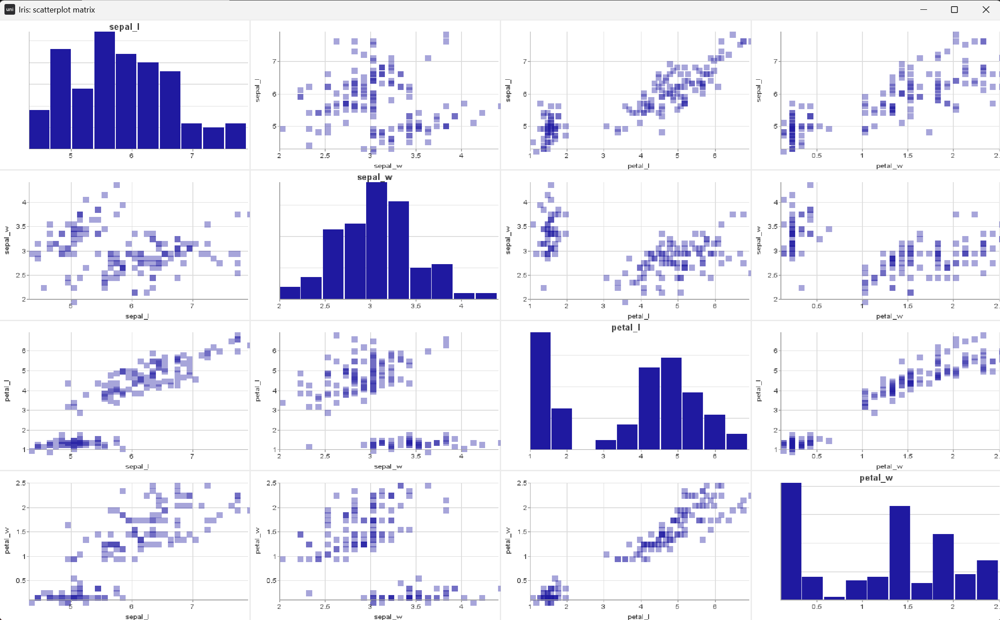

# uni.plot — Plot Guide

`uni.plot` adds interactive and file-based charting directly on `MatD` via XChart (GGPlot2 theme).

```scala
import uni.data.*
import uni.plot.*
```

---

## Methods

### `.pairs()` — scatterplot matrix

A p×p grid of subplots: histograms on the diagonal, scatter plots off-diagonal.
Each scatter cell shows axis tick marks, gridlines, and labelled x/y variable names.
Equivalent to R `pairs()` / seaborn `pairplot`.

The window is resizable — the plot re-renders at the new size automatically.

```scala
m.pairs(
  title        = "Iris: scatterplot matrix",  // window title
  labels       = Seq("sepal_l", "sepal_w", "petal_l", "petal_w"),
  bins         = 10,                       // histogram bucket count (default 10)
  dotSize      = 9,                        // scatter dot size in pixels (default 3)
  scatterAlpha = 90,                       // dot opacity 0–255 (default 80; lower = more transparent)
  color        = Color(31, 119, 180),      // bar and dot colour (default blue)
  labelStyle   = Font.BOLD,                // Font.PLAIN / Font.BOLD / Font.ITALIC (default BOLD)
  saveTo       = "docs/images/iris-pairs", // saves iris-pairs.png; omit to show window
  style        = PlotStyle(width = 1500, height = 900),
)
```

`scatterAlpha` is worth tuning: low values (40–60) reveal density in crowded plots;
higher values (150+) make sparse plots easier to read.

`labelStyle` accepts any `java.awt.Font` style constant — import `java.awt.Font` to use them.

<p align="center"><br><em>Fisher Iris — 4-feature pairplot (150 samples): note the strong petal_l ↔ petal_w correlation and the near-zero sepal_w correlation</em></p>

### `.plot()` — line chart

One series per column; x-axis = row indices.

```scala
m.plot(
  title  = "my chart",               // window / PNG title
  labels = Seq("col0", "col1"),      // series labels (defaults: "col0", "col1", …)
  saveTo = "out/chart",              // saves out/chart.png; omit to show window
  style  = PlotStyle(width = 900, height = 600, xLabel = "time", yLabel = "value"),
)
```

### `.scatter()` — scatter plot

Two columns plotted against each other; optional group colouring.

```scala
m.scatter(
  xCol     = 0,                      // column index for x-axis (default 0)
  yCol     = 1,                      // column index for y-axis (default 1)
  groupCol = 4,                      // colour points by this column (-1 = no grouping)
  title    = "x vs y",
  saveTo   = "out/scatter",
  style    = PlotStyle(width = 700, height = 700, xLabel = "feature A", yLabel = "feature B"),
)
```

### `.hist()` — histogram

All values in the matrix binned and plotted as an area chart.

```scala
m.hist(
  bins   = 20,                       // number of bins (default 20)
  title  = "distribution",
  saveTo = "out/hist",
  style  = PlotStyle(width = 800, height = 500, yLabel = "frequency"),
)
```

### `.bar()` — bar chart

One bar per row; labels come from a column or default to row indices.

```scala
m.bar(
  col      = 1,                      // column providing bar heights (default 0)
  labelCol = 0,                      // column providing x-axis labels (-1 = row indices)
  title    = "totals",
  saveTo   = "out/bar",
  style    = PlotStyle(xLabel = "category", yLabel = "count"),
)
```

### `.heatmap()` — heatmap

Renders the matrix as a colour grid. Useful for correlation and confusion matrices.

```scala
val features = Seq("sepal_l", "sepal_w", "petal_l", "petal_w")
corr.heatmap(
  title     = "Correlation matrix",
  rowLabels = features,
  colLabels = features,
  saveTo    = "out/corr",
  style     = PlotStyle(width = 700, height = 700),
)
```

### `.boxPlot()` — box plot

One box per column showing median, quartiles, and outliers.

```scala
m.boxPlot(
  title  = "feature distributions",
  labels = Seq("sepal_l", "sepal_w", "petal_l", "petal_w"),
  saveTo = "out/boxes",
  style  = PlotStyle(yLabel = "cm"),
)
```

---

## `PlotStyle`

All fields are optional — omit any field to keep the GGPlot2 theme default.

| Field | Type | Default | Effect |
| :--- | :--- | :--- | :--- |
| `width` | `Int` | method-specific | chart width in pixels |
| `height` | `Int` | method-specific | chart height in pixels |
| `background` | `Option[Color]` | `None` | outer chart background |
| `plotBackground` | `Option[Color]` | `None` | inner plot-area background |
| `foreground` | `Option[Color]` | `None` | axis labels and title colour |
| `seriesColors` | `Seq[Color]` | `Nil` | per-series colours in order |
| `xLabel` | `String` | `""` | x-axis label |
| `yLabel` | `String` | `""` | y-axis label |
| `xLog` | `Boolean` | `false` | logarithmic x-axis (XY charts only) |
| `yLog` | `Boolean` | `false` | logarithmic y-axis (XY charts only) |

### Named presets

| Preset | Value | Use case |
| :--- | :--- | :--- |
| `PlotStyle.uniform` | `PlotStyle(width = 800, height = 500)` | Consistent dimensions for saved images |

### Examples

**Axis labels:**
```scala
m.scatter(style = PlotStyle(xLabel = "principal component 1", yLabel = "principal component 2"))
```

**Log scale:**
```scala
m.plot(style = PlotStyle(yLog = true, yLabel = "loss (log scale)"))
```

**Dark background:**
```scala
import java.awt.Color
m.hist(style = PlotStyle(
  background     = Some(Color.BLACK),
  plotBackground = Some(new Color(30, 30, 30)),
  foreground     = Some(Color.WHITE),
))
```

**Custom series colours:**
```scala
import java.awt.Color
m.plot(style = PlotStyle(
  seriesColors = Seq(Color.RED, Color.BLUE, Color.GREEN),
))
```

**Uniform export size for documentation:**
```scala
m.scatter(2, 3, saveTo = "docs/images/iris-scatter", style = PlotStyle.uniform)
m.hist(bins = 20, saveTo = "docs/images/iris-hist",  style = PlotStyle.uniform)
// → both PNGs are exactly 800×500
```

---

## Demo scripts

| Script | Description |
| :--- | :--- |
| [`jsrc/corr.sc`](../jsrc/corr.sc) | Interactive: Iris correlation heatmap + two scatter windows showing strong vs weak correlation |
| [`jsrc/iris.sc`](../jsrc/iris.sc) | Interactive: scatter, histogram, and line plot on the Fisher Iris dataset |
| [`jsrc/anscombe.sc`](../jsrc/anscombe.sc) | Interactive: Anscombe's Quartet — four scatter plots with identical statistics |
| [`jsrc/irisPairedFeatures.sc`](../jsrc/irisPairedFeatures.sc) | Interactive: pairs (scatterplot matrix) on the Fisher Iris dataset |
| [`jsrc/airfoilNoise.sc`](../jsrc/airfoilNoise.sc) | Interactive: pairs (scatterplot matrix) on the UCI Airfoil Self-Noise dataset |
| [`jsrc/gen-images.sc`](../jsrc/gen-images.sc) | Headless: regenerates all `docs/images/iris-*.png` (line, scatter, grouped-scatter, hist, bar, corr, box, pairs) |
