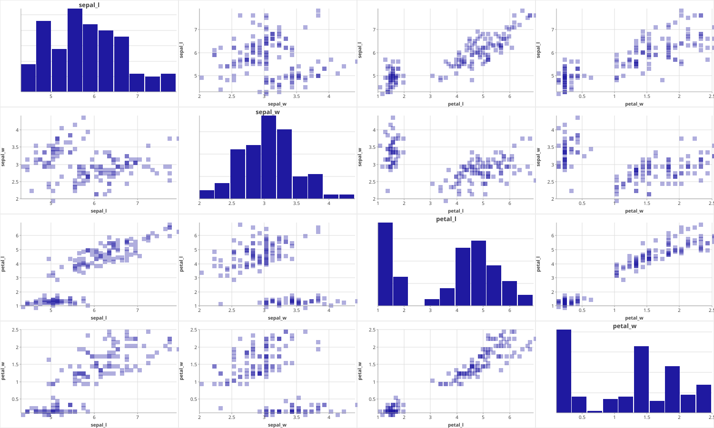

# uni.plot — Plot Guide

`uni.plot` adds charting directly on `MatD`: `plot`, `scatter`, `hist`, `bar`, `heatmap`,
`boxPlot`, `pairs`. Every chart is rendered to SVG text by the library itself — no charting
dependency, no AWT — and then either **saved** (`saveTo`: `<name>.svg`, or `.html` for a
page) or **shown** in a **standalone window**: a page is written to a temp file and your
default browser is launched in app mode (Chrome, Chromium, Edge, Brave, Vivaldi, Opera:
`--app=`, sized to the chart — no tabs, no address bar) or with `-new-window` (Firefox).
The default browser is read from the OS (Windows URL association, macOS LaunchServices,
`xdg-settings` on Linux); if it cannot be read, the PATH is probed with Edge last.
`UNI_PLOT_WINDOW=tab` gives a tab in the default browser instead, `UNI_PLOT_BROWSER=<name
or path>` picks the browser, `UNI_PLOT_NO_OPEN` prints the page's path (headless runs).
Each method has a `*Svg` twin (`plotSvg`, `scatterSvg`, …) that returns the SVG string.

The Rust crate has the same module (`uni::uplot`) and produces the same bytes: 98 fixture
rows pin every chart type across the two languages, so a chart drawn from a matrix on the
JVM and in Rust is the same file. Headless runs are fine: with no display, no opener, or
`UNI_PLOT_NO_OPEN` set, `show` prints the page's path instead of failing.

The XChart-backed renderer this replaced is still available for one release as
`uni.plot.xchart` (same method names, PNG output, Swing windows).

```text
import uni.data.*
import uni.plot.*
```

---

## Methods

### `.pairs()` — scatterplot matrix

A p×p grid of subplots: histograms on the diagonal, scatter plots off-diagonal.
Each scatter cell shows axis tick marks, gridlines, and labelled x/y variable names.
Equivalent to R `pairs()` / seaborn `pairplot`.

```scala
#!/usr/bin/env -S scala-cli shebang -Wunused:imports -Wunused:locals -deprecation

//> using dep org.vastblue:uni_3:0.19.3

import uni.data.*
import uni.plot.*
import java.awt.{Color, Font}

val m = MatD.randn(150, 4)   // any MatD: rows are samples, columns are features
m.pairs(
  title        = "Iris: scatterplot matrix",  // page title
  labels       = Seq("sepal_l", "sepal_w", "petal_l", "petal_w"),
  bins         = 10,                       // histogram bucket count (default 10)
  dotSize      = 9,                        // scatter dot size in pixels (default 3)
  scatterAlpha = 90,                       // dot opacity 0–255 (default 80; lower = more transparent)
  color        = Color(31, 119, 180),      // bar and dot colour (default blue)
  labelStyle   = Font.BOLD,                // Font.PLAIN / Font.BOLD / Font.ITALIC (default BOLD)
  saveTo       = "iris-pairs",             // saves iris-pairs.svg; omit to open the browser
  style        = PlotStyle(width = 1500, height = 900),
)
```

`scatterAlpha` is worth tuning: low values (40–60) reveal density in crowded plots;
higher values (150+) make sparse plots easier to read.

`labelStyle` accepts any `java.awt.Font` style constant — import `java.awt.Font` to use them.

<p align="center"><br><em>Fisher Iris — 4-feature pairplot (150 samples): note the strong petal_l ↔ petal_w correlation and the near-zero sepal_w correlation</em></p>

### `.plot()` — line chart

One series per column; x-axis = row indices.

```scala
#!/usr/bin/env -S scala-cli shebang -Wunused:imports -Wunused:locals -deprecation

//> using dep org.vastblue:uni_3:0.19.3

import uni.data.*
import uni.plot.*

val m = MatD.randn(150, 4)   // any MatD: rows are samples, columns are features
m.plot(
  title  = "my chart",               // page / chart title
  labels = Seq("col0", "col1"),      // series labels (defaults: "col0", "col1", …)
  saveTo = "chart",                  // saves chart.svg (or "chart.html"); omit to open the browser
  style  = PlotStyle(width = 900, height = 600, xLabel = "time", yLabel = "value"),
)
```

### `.scatter()` — scatter plot

Two columns plotted against each other; optional group colouring.

```scala
#!/usr/bin/env -S scala-cli shebang -Wunused:imports -Wunused:locals -deprecation

//> using dep org.vastblue:uni_3:0.19.3

import uni.data.*
import uni.plot.*

val m = MatD.randn(150, 5)   // column 4 holds a group id per row
m(::, 4) = m(::, 4).map(v => if v < 0 then 0.0 else 1.0)
m.scatter(
  xCol     = 0,                      // column index for x-axis (default 0)
  yCol     = 1,                      // column index for y-axis (default 1)
  groupCol = 4,                      // colour points by this column (-1 = no grouping)
  title    = "x vs y",
  saveTo   = "scatter",
  style    = PlotStyle(width = 700, height = 700, xLabel = "feature A", yLabel = "feature B"),
)
```

### `.hist()` — histogram

All values in the matrix binned and plotted as an area chart.

```scala
#!/usr/bin/env -S scala-cli shebang -Wunused:imports -Wunused:locals -deprecation

//> using dep org.vastblue:uni_3:0.19.3

import uni.data.*
import uni.plot.*

val m = MatD.randn(150, 4)   // any MatD: rows are samples, columns are features
m.hist(
  bins   = 20,                       // number of bins (default 20)
  title  = "distribution",
  saveTo = "hist",
  style  = PlotStyle(width = 800, height = 500, yLabel = "frequency"),
)
```

### `.bar()` — bar chart

One bar per row; labels come from a column or default to row indices.

```scala
#!/usr/bin/env -S scala-cli shebang -Wunused:imports -Wunused:locals -deprecation

//> using dep org.vastblue:uni_3:0.19.3

import uni.data.*
import uni.plot.*

val m = MatD((1.0, 12.0), (2.0, 7.0), (3.0, 15.0))   // column 0: category id, column 1: count
m.bar(
  col      = 1,                      // column providing bar heights (default 0)
  labelCol = 0,                      // column providing x-axis labels (-1 = row indices)
  title    = "totals",
  saveTo   = "bar",
  style    = PlotStyle(xLabel = "category", yLabel = "count"),
)
```

### `.heatmap()` — heatmap

Renders the matrix as a colour grid. Useful for correlation and confusion matrices.

```scala
#!/usr/bin/env -S scala-cli shebang -Wunused:imports -Wunused:locals -deprecation

//> using dep org.vastblue:uni_3:0.19.3

import uni.data.*
import uni.plot.*

val m = MatD.randn(150, 4)   // any MatD: rows are samples, columns are features
val corr = m.corrcoef        // 4×4 correlation matrix
val features = Seq("sepal_l", "sepal_w", "petal_l", "petal_w")
corr.heatmap(
  title     = "Correlation matrix",
  rowLabels = features,
  colLabels = features,
  saveTo    = "corr",
  style     = PlotStyle(width = 700, height = 700),
)
```

### `.boxPlot()` — box plot

One box per column showing median, quartiles, and outliers.

```scala
#!/usr/bin/env -S scala-cli shebang -Wunused:imports -Wunused:locals -deprecation

//> using dep org.vastblue:uni_3:0.19.3

import uni.data.*
import uni.plot.*

val m = MatD.randn(150, 4)   // any MatD: rows are samples, columns are features
m.boxPlot(
  title  = "feature distributions",
  labels = Seq("sepal_l", "sepal_w", "petal_l", "petal_w"),
  saveTo = "boxes",
  style  = PlotStyle(yLabel = "cm"),
)
```

---

## `PlotStyle`

All fields are optional — omit any field to keep the GGPlot2 theme default.

| Field | Type | Default | Effect |
| :--- | :--- | :--- | :--- |
| `width` | `Int` | method-specific | chart width in pixels |
| `height` | `Int` | method-specific | chart height in pixels |
| `background` | `Option[Color]` | `None` | outer chart background |
| `plotBackground` | `Option[Color]` | `None` | inner plot-area background |
| `foreground` | `Option[Color]` | `None` | axis labels and title colour |
| `seriesColors` | `Seq[Color]` | `Nil` | per-series colours in order |
| `xLabel` | `String` | `""` | x-axis label |
| `yLabel` | `String` | `""` | y-axis label |
| `xLog` | `Boolean` | `false` | logarithmic x-axis (XY charts only) |
| `yLog` | `Boolean` | `false` | logarithmic y-axis (XY charts only) |

### Named presets

| Preset | Value | Use case |
| :--- | :--- | :--- |
| `PlotStyle.uniform` | `PlotStyle(width = 800, height = 500)` | Consistent dimensions for saved images |

### Examples

**Axis labels:**
```scala
#!/usr/bin/env -S scala-cli shebang -Wunused:imports -Wunused:locals -deprecation

//> using dep org.vastblue:uni_3:0.19.3

import uni.data.*
import uni.plot.*

val m = MatD.randn(150, 4)   // any MatD: rows are samples, columns are features
m.scatter(saveTo = "pca", style = PlotStyle(xLabel = "principal component 1", yLabel = "principal component 2"))
```

**Log scale:**
```scala
#!/usr/bin/env -S scala-cli shebang -Wunused:imports -Wunused:locals -deprecation

//> using dep org.vastblue:uni_3:0.19.3

import uni.data.*
import uni.plot.*

val m = MatD.tabulate(50, 1)((i, _) => math.exp(-i / 10.0))   // a decaying loss curve
m.plot(saveTo = "loss", style = PlotStyle(yLog = true, yLabel = "loss (log scale)"))
```

**Dark background:**
```scala
#!/usr/bin/env -S scala-cli shebang -Wunused:imports -Wunused:locals -deprecation

//> using dep org.vastblue:uni_3:0.19.3

import uni.data.*
import uni.plot.*

val m = MatD.randn(150, 4)   // any MatD: rows are samples, columns are features
import java.awt.Color
m.hist(saveTo = "dark-hist", style = PlotStyle(
  background     = Some(Color.BLACK),
  plotBackground = Some(new Color(30, 30, 30)),
  foreground     = Some(Color.WHITE),
))
```

**Custom series colours:**
```scala
#!/usr/bin/env -S scala-cli shebang -Wunused:imports -Wunused:locals -deprecation

//> using dep org.vastblue:uni_3:0.19.3

import uni.data.*
import uni.plot.*

val m = MatD.randn(150, 4)   // any MatD: rows are samples, columns are features
import java.awt.Color
m.plot(saveTo = "rgb", style = PlotStyle(
  seriesColors = Seq(Color.RED, Color.BLUE, Color.GREEN),
))
```

**Uniform export size for documentation:**
```scala
#!/usr/bin/env -S scala-cli shebang -Wunused:imports -Wunused:locals -deprecation

//> using dep org.vastblue:uni_3:0.19.3

import uni.data.*
import uni.plot.*

val m = MatD.randn(150, 4)   // any MatD: rows are samples, columns are features
m.scatter(2, 3, saveTo = "iris-scatter", style = PlotStyle.uniform)
m.hist(bins = 20, saveTo = "iris-hist",  style = PlotStyle.uniform)
// → both SVGs are exactly 800×500
```

---

## Demo scripts

| Script | Description |
| :--- | :--- |
| [`jsrc/corr.sc`](../jsrc/corr.sc) | Interactive: Iris correlation heatmap + two scatter windows showing strong vs weak correlation |
| [`jsrc/iris.sc`](../jsrc/iris.sc) | Interactive: scatter, histogram, and line plot on the Fisher Iris dataset |
| [`jsrc/anscombe.sc`](../jsrc/anscombe.sc) | Interactive: Anscombe's Quartet — four scatter plots with identical statistics |
| [`jsrc/irisPairedFeatures.sc`](../jsrc/irisPairedFeatures.sc) | Interactive: pairs (scatterplot matrix) on the Fisher Iris dataset |
| [`jsrc/airfoilNoise.sc`](../jsrc/airfoilNoise.sc) | Interactive: pairs (scatterplot matrix) on the UCI Airfoil Self-Noise dataset |
| [`jsrc/gen-images.sc`](../jsrc/gen-images.sc) | Headless: regenerates the `docs/images/iris-*` charts (line, scatter, grouped-scatter, hist, bar, corr, box, pairs) |
